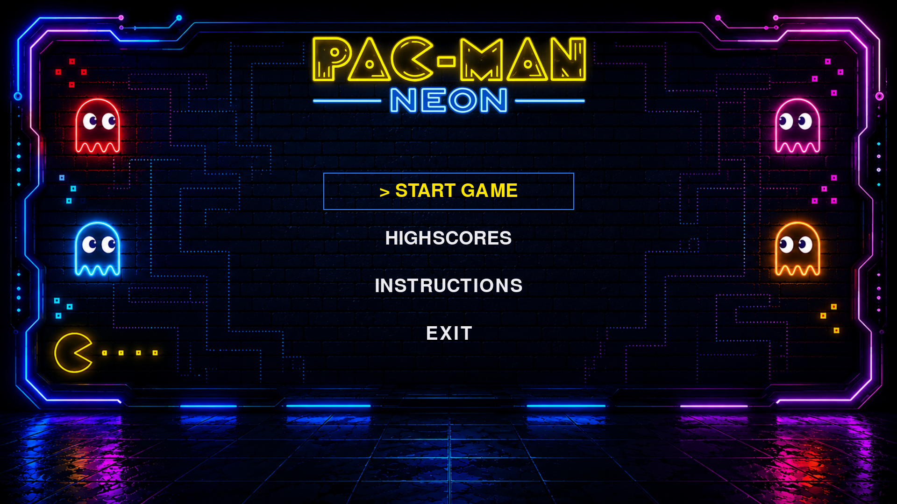
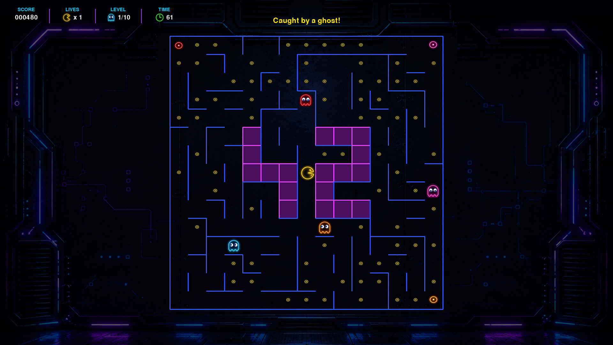
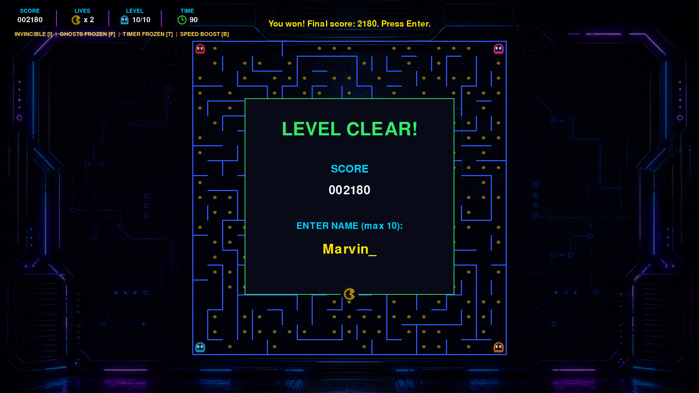

*This project has been created as part of the 42 curriculum by oshtohri, aunoguei.*


# Pac-Man 🟡👻

A complete, modern, and modular recreation of the classic 1980 Namco arcade game **Pac-Man**, implemented in Python 3.10+ using object-oriented architecture, clean code principles, and Pygame constrained to MLX-equivalent graphical primitives.

---

## Table of Contents

- [Description](#description)
- [Screenshots](#screenshots)
- [Instructions](#instructions)
- [Configuration](#configuration)
- [Highscore System](#highscore-system)
- [Maze Generation](#maze-generation)
- [Implementation](#implementation)
- [General Software Architecture](#general-software-architecture)
- [Project Management](#project-management)
- [Resources & AI Usage](#resources--ai-usage)

---

## Description

The goal of this project is to build a fully functional arcade Pac-Man game with multi-level progression, persistent scoring, intelligent ghost behavior, custom configuration handling, and cheat modes for review purposes.

### Key Features
- **Arcade Gameplay**: Smooth corridor navigation, score tracking, dynamic HUD, power pellets (Super Pacgums), and frightened/respawning ghost mechanics.
- **Distinct Ghost AI**: Four unique ghost personalities (Blinky, Pinky, Inky, Clyde) powered by Breadth-First Search (BFS) pathfinding.
- **Robust Configuration**: Configurable parameters via JSON files supporting comments (`#` and `//`) with graceful fallback handling.
- **Third-Party Maze Adapter**: Seamless integration with assigned `A-Maze-ing` package producing non-perfect Pac-Man corridors.
- **Persistent Highscores**: Top 10 leaderboard saved to disk with player name validation.
- **Interactive & Responsive UI**: Custom sprite atlases, responsive HUD, mouse & keyboard navigation, and scaled game views.
- **Cheat Suite**: Built-in developer hotkeys for peer review evaluation.

---

## Screenshots





---

## Instructions

### Prerequisites
- Linux OS (for pre-built binary execution)
- Python 3.10 or later
- `pip` or any modern Python package manager (`uv`, `venv`)

### Installation & Setup

### Option A: Running the Standalone Executable (Itch.io Release Build)

A pre-packaged, standalone Linux executable is available for demonstration and evaluation on our private Itch.io page. No Python or Pygame installation is required for this build.

1. **Download the Release Archive**:
   Download `pacman-linux.zip` from our Itch.io project page:
   👉 **[Pac-Man Itch.io Private Release Page](https://osh-games.itch.io/pacman-42project)** *(Unlisted / Private evaluation build)*

2. **Extract the Package**:
   Unzip the release archive in your terminal:
   ```bash
   unzip pacman-linux.zip -d pacman-release
   cd pacman-linux
   ```

3. **Ensure Execution Permissions**:
   ```bash
   chmod +x pacman-linux
   ```

4. **Execute the Binary**:
   Run the standalone executable by passing the configuration file:
   ```bash
   ./pacman-linux config.json
   ```

---

### Option B: Running from Source Code (Development Mode)

1. **Clone the repository**:
   ```bash
   git clone <repository_url>
   cd pac-man
   ```

2. **Install dependencies via Makefile**:
   ```bash
   make install
   ```

3. **Execution**:
   Launch the game by providing a valid configuration file:
   ```bash
   python3 pac-man.py config.json
   ```
   or using the Makefile:
   ```bash
   make run
   ```

4. **Packaging a New Release Build**:
   To generate a new standalone Linux binary and Itch.io release ZIP package:
   ```bash
   make package
   ```
   or
   ```bash
   make build
   ```
   The generated package will be saved at `dist/pacman-linux.zip`.

---

### Makefile Targets

| Command | Description |
| :--- | :--- |
| `make install` | Install required project dependencies (`pygame`). |
| `make run` | Execute the main game entry point with `config.json`. |
| `make debug` | Run the main script in debug mode using `pdb`. |
| `make clean` | Clean temporary files, bytecode (`__pycache__`), and cache directories. |
| `make fclean` | Clean temporary files, and virtualenviroment . |
| `make lint` | Run static analysis using `flake8 .` and `mypy` with mandatory flags. |
| `make lint-strict` | Execute strict linting checks (`mypy --strict`). |
| `make build` | Build standalone PyInstaller executable and create `dist/pacman-linux.zip` for Itch.io.  |

---

## Configuration

The game is configured via a JSON file provided as the command-line argument. The loader is robust, ignoring comments and clamping out-of-range or missing values to safe defaults without raising uncaught exceptions.

### Comment Handling
Lines starting with `#` or `//` are stripped prior to JSON parsing.

### Configuration Schema (`config.json`)

```json
{
  # Path to persistent leaderboard storage
  "highscore_filename": "highscores.json",

  # Player starting lives and scoring parameters
  "lives": 3,
  "points_per_pacgum": 10,
  "points_per_super_pacgum": 50,
  "points_per_ghost": 200,

  # Multilevel Array (At least 10 levels enforced automatically)
  "levels": [
    {
      "width": 21,
      "height": 21,
      "pacgum": 42,
      "seed": 42,
      "level_max_time": 90
    },
    ...
  ]
}
```

### Faulty Config Handling
If keys are missing, invalid, or corrupted, the loader logs a clear warning message (`LOGGER.warning`), clamps numerical values to valid boundaries (`Limits`), and guarantees at least 10 levels using default `LevelConfig` instances.

---

## Highscore System

The persistent highscore system is encapsulated within the `ScoreRegistry` and backed by `JsonHighscoreRepository`.

### System Highlights:
- **Persistence**: Saved to a JSON file specified in the configuration (`highscore_filename`).
- **Validation**:
  - Names are restricted to 1–10 characters containing only alphanumeric characters and spaces (`[A-Za-z0-9 ]{1,10}`).
  - Scores are validated as non-negative integers ($\ge 0$).
- **Top 10 Retention**: Only the top 10 highest scores are retained on disk, sorted in descending order.
- **Error Resiliency**: Unreadable, corrupt, or missing files gracefully return an empty score registry without crashing the application.
- **Design Rationale**: Decoupling persistence from the domain logic ensures that highscore management can be independently unit-tested without disk I/O dependencies.

---

## Maze Generation

Maze generation relies on the assigned external `A-Maze-ing` wheel package without modifying its internal source code.

### Integration Adapter (`AmazingMazeFactory`)
- The application interacts with the maze generator through the
  `MazeFactory` port.
- `AmazingMazeFactory` implements this port and adapts the assigned
  `A-Maze-ing` package to the application's `Maze` domain model.
- **Corridor Compatibility**: Mazes are generated with `perfect=False` to produce Pac-Man-compatible loops and multiple corridors.
- **Reproducibility**: The first level uses a deterministic fixed seed (e.g., `42`), while subsequent levels generate randomized seeds.
- **Decorative 42 Pattern**: Cells belonging to the decorative `42` central mark (wall bitmask `15`) are flagged as un-walkable obstacles; no collectible items spawn inside them.
- **Error Handling**: If the external package fails to generate a grid or produces an unsolvable maze, `MazeGenerationError` is raised and caught cleanly at startup.

---

## Implementation

### Player & Movement
- Player moves strictly through corridors using WASD or Arrow keys.
- Movement coordinates are interpolated smoothly between logical grid cells (`_player_visual_position`) for fluid rendering.

### Ghost AI & Behavioral States

Ghosts move autonomously and their personality determine their targets in Chase mode. BFS is then used to select a shortest path towards the chosen target.  
In Frightened mode, ghosts instead select legal moves that maximize
their distance from the player.

1. **Chase Mode**: Each ghost follows a distinct targeting strategy:
   - **Blinky (Red)**: Targets Pac-Man's exact tile.
   - **Pinky (Pink)**: Targets 4 tiles ahead of Pac-Man's direction.
   - **Inky (Cyan)**: Uses Blinky's position and Pac-Man's tile to calculate a mirrored vector target.
   - **Clyde (Orange)**: Chases Pac-Man when far away, but retreats to his corner when within 8 tiles.
2. **Frightened Mode**: Triggered by eating a Super Pacgum. Ghosts become edible and select legal moves that maximize their distance from the player.
3. **Respawning Mode**: When eaten, a ghost turns into eyes and returns to its home corner before re-entering Chase mode.

### Game Progression

- The player starts with 3 lives.
- A collision with a non-frightened ghost removes one life.
- The player respawns at the level spawn position.
- Ghosts return to their home positions after a life is lost.
- The game enters Game Over when the player loses the last life.
- Completing all configured levels results in Victory.
- Score and remaining lives are preserved between levels.

### End of Game

When the player loses all lives, the Game Over screen displays the final
score and allows the player to enter a name for the highscore table.

When all levels are completed, the Victory screen displays the final score
and provides the same highscore entry flow.

After either outcome, the player can return to the main menu.

### Cheat Mode (Peer Review Tools)
Dedicated hotkeys allow reviewers to easily test game mechanics:
- `I`: Toggle Invincibility (ghosts cannot hurt player).
- `F`: Toggle Ghost Freeze (ghosts stop moving).
- `T`: Toggle Timer Freeze (level timer pauses).
- `B`: Toggle Speed Boost (doubles player movement speed).
- `N`: Level Skip (instantly completes current level).
- `L`: Add Extra Life (+1 life).

### MLX Compliance Rules
To comply with 42 evaluation rules regarding MiniLibX equivalence:
- High-level Pygame convenience methods (such as `Rect.collidepoint`) are replaced with pure mathematical boundary checks (`left <= x <= right`).
- Image transformation modules (`pygame.transform.smoothscale`) are replaced with a custom cached pixel resampling helper (`scale_image`).
- Rendering relies on image blitting (`screen.blit`), basic geometric primitives, and pre-rendered static sprite atlases.

---

## General Software Architecture

The project uses a modular architecture inspired by **Hexagonal / Clean Architecture** principles.
The main design goal is to keep the game rules independent from Pygame, the external maze generator, and persistent storage.  
The architecture is divided into five main areas:

- `domain/`: core game entities and value objects.
- `application/`: game rules, use cases and simulation orchestration.
- `adapters/`: integration with external systems such as configuration,
  maze generation and JSON persistence.
- `scores/`: highscore validation and score management.
- `ui/`: Pygame presentation and user input handling.

### Project structure

```text
src/
├── domain/               # Pure business models (Maze, Player, Ghost, Position)
│   ├── config.py
│   ├── geometry.py
│   ├── ghost.py
│   ├── item.py
│   ├── maze.py
│   └── player.py
│
├── application/          # Use cases & game loop orchestration (GameSession, AI, Collisions)
│   ├── game_session.py
│   ├── contracts.py
│   ├── input.py
│   ├── level_loader.py
│   ├── update.py
│   ├── movement.py
│   ├── collisions.py
│   ├── ghost_ai.py
│   ├── pathfinding.py
│   ├── item_placement.py
│   ├── interpolation.py
│   └── snapshot.py
│
├── adapters/             # External integration (ConfigLoader, AmazingMazeFactory)
│   ├── config_loader.py
│   ├── amazing_maze_factory.py
│   └── json_highscore_repository.py
│
├── scores/               # Highscore domain and JsonRepository
│   ├── highscore.py
│   ├── highscore_repository.py
│   └── score_registry.py
│
└── ui/                   # Modular presentation layer
    ├── pygame_app.py
    ├── draw_utils.py     
    ├── input_handler/    
    ├── menu_renderer/    
    ├── game_renderer/    
    └── neon_assets/      

```
#### Core class relationships

`GameSession` is the central application object. It owns the current
game state and coordinates the main gameplay use cases.

The main relationships are:

- `GameSession` uses a `MazeFactory` to create the current `Maze`.
- `GameSession` owns the current `Player`, `Ghost` instances and collectible
  `Item`s.
- `level_loader` initializes `GameSession` for a new level.
- `input` translates `InputAction` commands into changes to `GameSession`.
- `movement` updates the positions of the `Player` and `Ghost`s.
- `collisions` resolves interactions between the player, ghosts and items.
- `ghost_ai` determines ghost targets, while `pathfinding` calculates legal
  shortest paths through the maze.
- `snapshot` exposes the current state to the UI without allowing the
  renderer to modify the simulation.
- The UI therefore depends on the application state, while the application
  does not depend on the rendering implementation.

#### Application layer

The `application/` package contains the main game logic and coordinates the
different systems involved in each simulation step.

| Module              | Responsibility                                                                                   |
| ------------------- | ------------------------------------------------------------------------------------------------ |
| `game_session.py`   | Owns the current game state and coordinates the game lifecycle.                                  |
| `contracts.py`      | Defines application-level states and input commands such as `GamePhase` and `InputAction`.       |
| `input.py`          | Translates player actions into changes to the active `GameSession`.                              |
| `level_loader.py`   | Starts games, creates levels, initializes player/ghost positions and advances level progression. |
| `update.py`         | Updates timers and time-dependent gameplay state.                                                |
| `movement.py`       | Applies player and ghost movement rules.                                                         |
| `collisions.py`     | Resolves player/ghost and collectible collisions.                                                |
| `ghost_ai.py`       | Calculates the individual targeting strategies of Blinky, Pinky, Inky and Clyde.                 |
| `pathfinding.py`    | Provides grid navigation and shortest-path movement using BFS.                                   |
| `item_placement.py` | Places Pac-Gums and Super Pac-Gums while respecting reserved and non-walkable cells.             |
| `interpolation.py`  | Calculates visual positions between logical grid cells for smooth rendering.                     |
| `snapshot.py`       | Builds the read-only state consumed by the presentation layer.                                   |


#### Domain layer

The `domain/` package contains the core game entities and value objects.

- `Player` represents the player state, position, direction and lives.
- `Ghost` represents a ghost, including its personality and current mode.
- `Maze` represents the generated grid and its movement/wall rules.
- `Position` and `Direction` represent spatial and movement concepts.
- `Item` represents Pac-Gums and Super Pac-Gums.
- `GameConfig` and `LevelConfig` represent validated game configuration.

The domain does not depend on Pygame or the external maze generator.


#### Adapters

The adapter layer isolates external dependencies from the application:

- `ConfigLoader` converts the external JSON configuration into validated
domain configuration.
- `AmazingMazeFactory` adapts the assigned A-Maze-ing package to the
application's `MazeFactory` interface.
- `JsonHighscoreRepository` provides persistent highscore storage.

This means that the application does not need to know how the external
generator or JSON files are implemented.


#### Scores

The `scores/` package contains the highscore rules independently from the
file format.

`ScoreRegistry` validates scores and player names, keeps the top 10 entries
and delegates persistence to the repository abstraction.


#### UI layer

The `ui/` package is responsible only for presentation and user interaction.

It is intentionally kept separate from the game rules:

- `input_handler/` converts Pygame events into application `InputActions`.
- `menu_renderer/` renders menus and end screens.
- `game_renderer/` renders the maze, player, ghosts, items and HUD.
- `neon_assets/` loads and manages graphical assets.
- `pygame_app.py` owns the Pygame application loop and connects the UI to the application layer.

The UI does not implement game rules such as ghost targeting, collision resolution or level progression.

### Main data flow

```

                         PAC-MAN ARCHITECTURE
                         ====================


┌──────────────────────────────────────────────────────────────────────┐
│                              UI / PYGAME                             │
│                                                                      │
│  pygame_app.py                                                       │
│       │                                                              │
│       ├── input_handler/                                             │
│       │     ├── menu input                                           │
│       │     ├── gameplay input                                       │
│       │     ├── pause input                                          │
│       │     └── end-screen input                                     │
│       │                                                              │
│       ├── menu_renderer/                                             │
│       ├── game_renderer/                                             │
│       ├── draw_utils.py                                              │
│       └── neon_assets/                                               │
│                                                                      │
│       │  Pygame events / rendering                                   │
└───────┼──────────────────────────────────────────────────────────────┘
        │
        │ InputAction
        ▼
┌──────────────────────────────────────────────────────────────────────┐
│                         APPLICATION LAYER                            │
│                    GAME RULES & ORCHESTRATION                        │
│                                                                      │
│  ┌───────────────────────┐                                           │
│  │      GameSession      │◄──────────── main application state       │
│  │                       │                                           │
│  │  lifecycle / phases   │                                           │
│  │  score / lives        │                                           │
│  │  level progression    │                                           │
│  │  dispatch(InputAction)│                                           │
│  └───────────┬───────────┘                                           │
│              │                                                       │
│      ┌───────┼────────┬──────────┬──────────┬──────────┐             │
│      ▼       ▼        ▼          ▼          ▼          ▼             │
│  movement  collisions ghost_ai  pathfinding update  level_loader     │
│      │       │        │          │          │          │             │
│      │       │        │          │          │          └─ levels     │
│      │       │        └──────────┘          │                        │
│      │       │          BFS / targets       │                        │
│      │       │                              │                        │
│      └───────┴──────────────────────────────┘                        │
│                                                                      │
│  item_placement     interpolation      snapshot                      │
│       │                  │                │                          │
│       └──── gameplay ────┘                └── read-only game state ──┼──► UI
│                                                                      │
└──────────────────────────────┬───────────────────────────────────────┘
                               │
                               │ operates on
                               ▼
┌──────────────────────────────────────────────────────────────────────┐
│                            DOMAIN LAYER                              │
│                       CORE GAME MODELS                               │
│                                                                      │
│   Player        Ghost        Maze        Item                        │
│      │            │           │           │                          │
│      └────────────┴───────────┴───────────┘                          │
│                           │                                          │
│                  Position / Direction                                │
│                                                                      │
│              GameConfig / LevelConfig                                │
│                                                                      │
│       No Pygame • No JSON • No A-Maze-ing dependency                 │
└──────────────────────────────────────────────────────────────────────┘


          External dependencies are isolated behind adapters
                              │
                 ┌────────────┴────────────┐
                 │                         │
                 ▼                         ▼
┌─────────────────────────────┐  ┌─────────────────────────────────────┐
│          ADAPTERS           │  │               SCORES                │
│                             │  │                                     │
│ ConfigLoader                │  │ ScoreRegistry                       │
│ AmazingMazeFactory          │  │ Highscore                           │
│ JsonHighscoreRepository     │  │ HighscoreRepository                 │
│                             │  │                                     │
│ config.json                 │  │ highscores.json                     │
│ A-Maze-ing package          │  │                                     │
└─────────────────────────────┘  └─────────────────────────────────────┘
```

#### Snapshot-based rendering

The application produces a read-only Snapshot representing the current game state.

```
GameSession
     │
     │ simulation
     ▼
Snapshot
     │
     ▼
Game Renderer
```

The renderer consumes this state without directly modifying the game model.
This keeps rendering concerns separate from gameplay logic.

## Project Management

The development process followed a structured project management methodology divided into 3 iterations (Timeline, Gantt chart, Risk Matrix, and RACI distribution).

### Team RACI Matrix

| Task / Responsibility | `aunoguei` | `oshtohri` |
| :--- | :---: | :---: |
| Architecture & Layer Contracts | **A / R** | **A / R** |
| Engine Logic & BFS Pathfinding | **A / R** | C |
| Configuration Loader & Limits | **A / R** | C |
| Ghost AI Personalities & States | **A / R** | C |
| Maze Adapter (`A-Maze-ing`) | C | **A / R** |
| Pygame UI & Responsive Scaling | C | **A / R** |
| Sprite Atlases & Visual Assets | C | **A / R** |
| Highscore System Persistence | **A / R** | C |
| Documentation & Packaging | **A / R** | **A / R** |

*Key: **A** = Accountable, **R** = Responsible, **C** = Consulted*

All project management evidence, Gantt charts, risk mitigation plans, test plans, and retrospective documents are located in the dedicated repository subdirectory:

📁 **[`/docs/project_management/`](./docs/)**

---

## Resources & AI Usage

### References & Documentation
- [Pac-Man Dossier by Jamey Pittman](https://pacman.holenet.info/) — Detailed arcade mechanics, ghost behavioral logic, and timing specs.
- [Python 3.10+ Typing Documentation](https://docs.python.org/3/library/typing.html) — Static type hints and mypy practices.
- [Pygame Community Documentation](https://www.pygame.org/docs/) — Official Pygame API documentation for display initialization, event handling, and surface blitting.
- [Red Blob Games: Introduction to A* and BFS Pathfinding](https://www.redblobgames.com/pathfinding/a-star/introduction.html) — Conceptual guide and visual walkthrough of Breadth-First Search algorithms for grid maps.
- [PyInstaller Manual](https://pyinstaller.org/en/stable/) — Official documentation for bundling Python applications into standalone executables.
- [PEP 257 — Docstring Conventions](https://peps.python.org/pep-0257/) & [PEP 8 — Style Guide for Python Code](https://peps.python.org/pep-0008/) — Official Python code quality and docstring standards.
- [Maze Generation Algorithms (Wikipedia)](https://en.wikipedia.org/wiki/Maze_generation_algorithm) — Background on Depth-First Search and Prim's algorithm maze generation logic.
- [Real Python - SOLID Principles of Object-Oriented Design in Python](https://realpython.com/solid-principles-python/) — A comprehensive, Python-specific guide explaining the five SOLID design principles.

### AI Usage Description
In accordance with Chapter II (AI Instructions), AI tools (ChatGPT/Claude) were utilized selectively as a learning and productivity aid:
- **Refactoring & Architecture Brainstorming**: Assisted in discussing clean Hexagonal Architecture boundaries, separating renderer modules from engine state, and designing MLX-compliant primitive abstractions.
- **Documentation & Formatting**: Aided in drafting documentation templates, markdown tables, and organizing project management reports.
- **Code Review & Linting**: Used to double-check edge cases for `flake8` compliance (line length limits, PEP 257 docstrings) and type annotations.
- **Verification**: All AI-generated logic was thoroughly walked through, tested, peer-reviewed, and validated by both team members before integration.

---