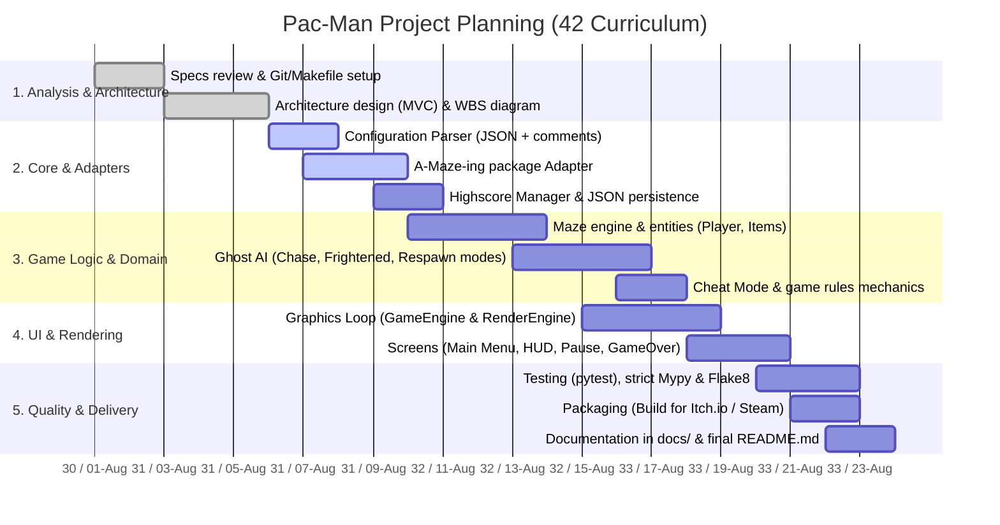

# Project Management & Timeline

## Gantt Chart

```mermaid
gantt
    title Pac-Man Project Planning (42 Curriculum)
    dateFormat  YYYY-MM-DD
    axisFormat  %W / %d-%b

    section 1. Analysis & Architecture
    Specs review & Git/Makefile setup              :done, des1, 2026-08-01, 2d
    Architecture design (MVC) & WBS diagram         :done, des2, 2026-08-03, 3d

    section 2. Core & Adapters
    Configuration Parser (JSON + comments)          :active, core1, 2026-08-06, 2d
    A-Maze-ing package Adapter                      :active, core2, 2026-08-07, 3d
    Highscore Manager & JSON persistence            :core3, 2026-08-09, 2d

    section 3. Game Logic & Domain
    Maze engine & entities (Player, Items)          :dom1, 2026-08-10, 4d
    Ghost AI (Chase, Frightened, Respawn modes)     :dom2, 2026-08-13, 4d
    Cheat Mode & game rules mechanics              :dom3, 2026-08-16, 2d

    section 4. UI & Rendering
    Graphics Loop (GameEngine & RenderEngine)       :ui1, 2026-08-15, 4d
    Screens (Main Menu, HUD, Pause, GameOver)       :ui2, 2026-08-18, 3d

    section 5. Quality & Delivery
    Testing (pytest), strict Mypy & Flake8          :qa1, 2026-08-20, 3d
    Packaging (Build for Itch.io / Steam)           :qa2, 2026-08-21, 2d
    Documentation in docs/ & final README.md        :qa3, 2026-08-22, 2d
```