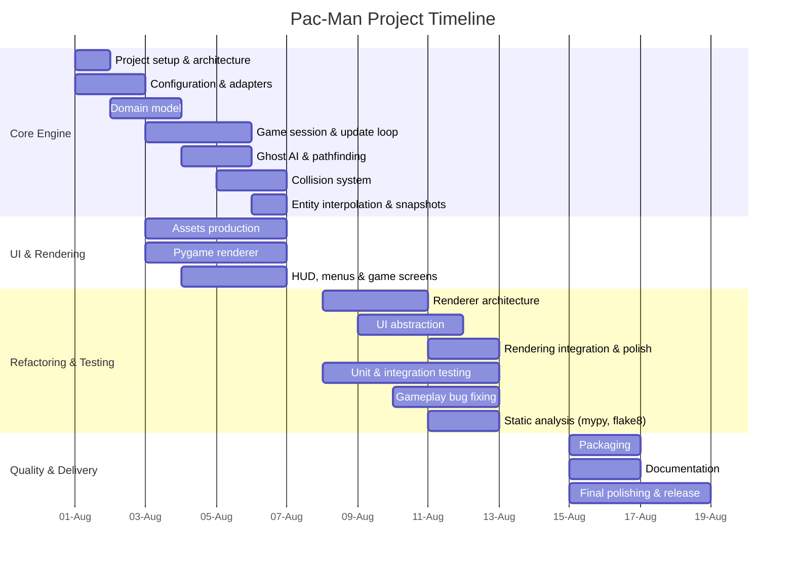

# Project Timeline

The project was initially planned over four weeks, with an estimated workload of approximately **150 hours** distributed across two developers. Thanks to an early focus on the engine architecture and the parallel development of the rendering system, implementation progressed faster than originally expected. As a result, the second week is dedicated primarily to renderer refactoring, UI abstraction and testing, while the final week focuses on release preparation, packaging and documentation.

## Planned Schedule

### Week 1 (~60h)

Main milestones:

- Project setup (Git, Makefile, coding standards)
- Layered Architecture design
- Configuration loader and JSON parser
- A-Maze-ing adapter integration
- Highscore persistence
- Domain model (Maze, Position, Player, Ghost, Items)
- Game session and game loop
- Level loading
- Ghost AI (BFS pathfinding and personalities)
- Collision system
- Entity interpolation and renderer snapshots
- Parallel development of the Pygame renderer, assets and game loop

### Week 2 (~60h)

With the core functionality already implemented, the second week focuses on improving the internal architecture of the rendering layer and increasing the level of abstraction in the UI. In parallel, unit and integration tests are developed, while gameplay polishing, bug fixing and static analysis (mypy and flake8) are carried out to prepare the project for release.

Main milestones:

- Improve Pygame renderer abstraction
- Decouple rendering from engine
- Improve UI architecture
- HUD polishing
- Menu improvements
- Animation polishing
- Asset integration
- Unit tests
- Integration tests
- Gameplay balancing
- Bug fixing
- Static analysis (mypy & flake8)

### Week 3 (~30h)

Final stabilization and release preparation including packaging, documentation and delivery.

Main milestones:

- Packaging
- Documentation
- Final release build

## Gantt Chart

## Weekly Progress vs. Planned Baseline

| Week       | Planned Goals                                    | Actual Delivered                                                                                                                                                                | Status / Variances                                                                                                                          |
| :--------- | :----------------------------------------------- | :------------------------------------------------------------------------------------------------------------------------------------------------------------------------------ | :------------------------------------------------------------------------------------------------------------------------------------------ |
| **Week 1** | Core engine implementation and initial rendering | Core engine completed (configuration, adapters, domain model, game session, AI, collisions, interpolation) together with a functional Pygame renderer, assets and UI foundation | **Completed ahead of schedule.** Completed ahead of schedule. Parallel development allowed the rendering layer to mature alongside the core engine, bringing forward a substantial portion of the work originally planned for Week 2. |
| **Week 2** | Renderer refactoring and testing                 | Improve renderer architecture and UI abstraction while expanding unit and integration tests, fixing gameplay issues and performing static analysis                              | **On schedule.** Focus shifts from feature development to code quality and maintainability.                                                 |
| **Week 3** | Packaging and delivery                           | Final documentation, packaging, release preparation and final polish                                                                                                            | **On schedule.** Reserved primarily for stabilization and project delivery rather than feature implementation.                              |
