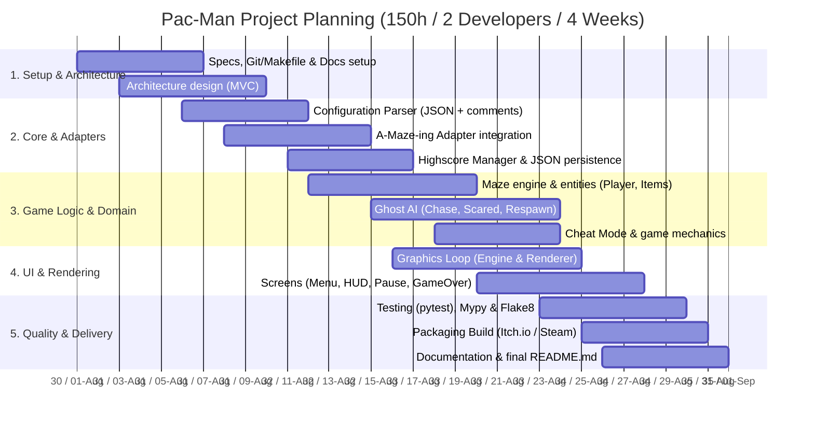

Semana 1 (Arch & Adapters - ~40h en total): Análisis del subject, setup de Git/Makefile, ConfigLoader y MazeAdapter (A-Maze-ing).

Semana 2 (Core Logic & AI - ~40h en total): Entidades (Player, Ghost), colisiones, algoritmos de IA de los fantasmas (Chase, Frightened, Respawn) y Cheat Mode.

Semana 3 (UI & Rendering - ~35h en total): Bucle gráfico, RenderEngine, menús, HUD, gestión del estado e integración del sistema de Highscores.

Semana 4 (QA, Packaging & Docs - ~35h en total): Pruebas unitarias, linteo estricto (flake8, mypy), script de empaquetado (Steam/Itch.io) y documentación final.

## Gantt Chart

## Weekly Progress vs. Planned Baseline

| Week | Planned Goals | Actual Delivered | Status / Variances |
| :--- | :--- | :--- | :--- |
| **Week 1** | Config & MazeAdapter | Config & MazeAdapter complete | On track |
| **Week 2** | Domain Logic & Ghost AI | Ghost AI took +5 hours due to edge cases | +1 day variance (Mitigated in W3) |
| **Week 3** | UI Screens & Highscore | Menus & Highscore integrated | On track |
| **Week 4** | QA, Packaging & Docs | Packaging script & strict linting done | Finalized |